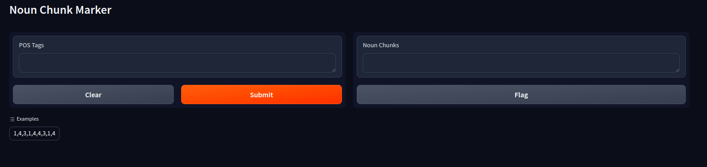

# Assignment-2 : Noun Chunk Marking

## Training Methods

We trained a recurrent perceptron with 10 inputs as described in the problem statement. For training we used momentum with SGD as optimizer and achieved 80% train accuracy and 76% test accuracy.

## How to Use this code

Clone this repo [https://github.com/utsav-desai/CS772](). Open terminal do the following

```bash
cd CS772/assign2-RNNs/
python app.py
```

You will the following UI, enter your the POS Tags for your text, an example input is listed.



Python Packages Required

* numpy==1.24.3
* matplotlib==3.7.5
* sklearn==1.2.1
* Flask==3.0.2
* Gradio==4.24.0
